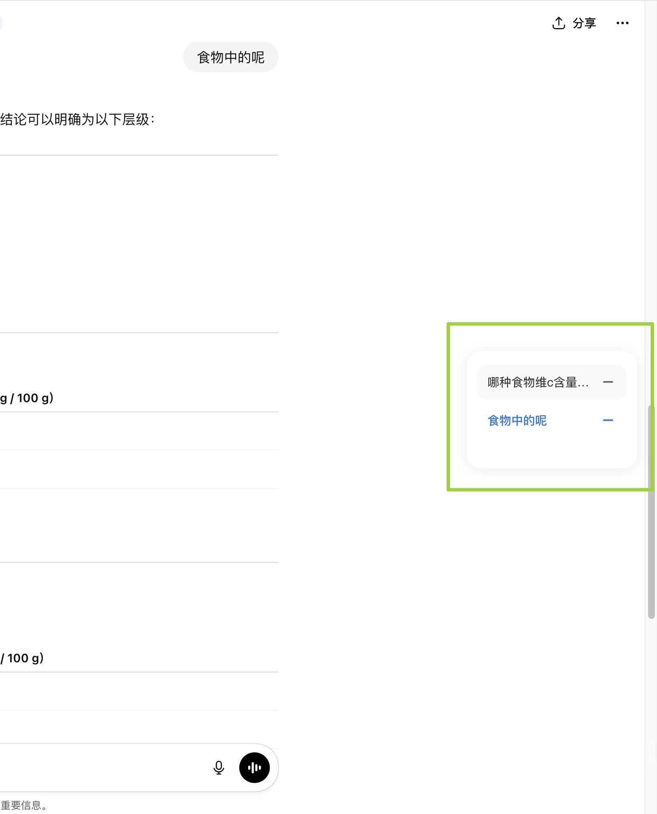
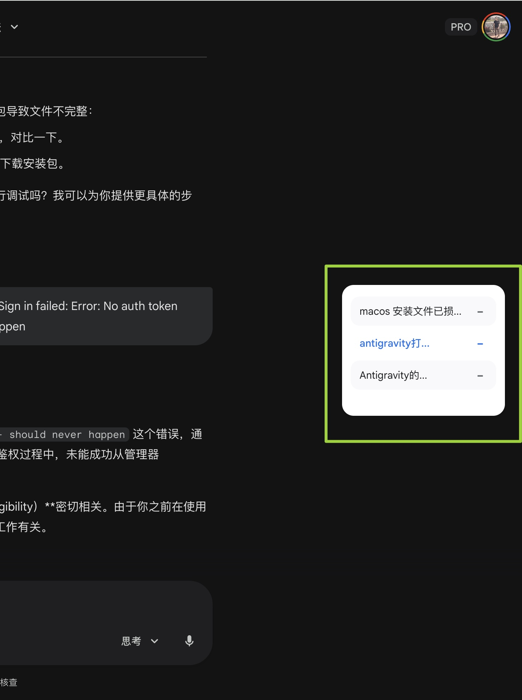
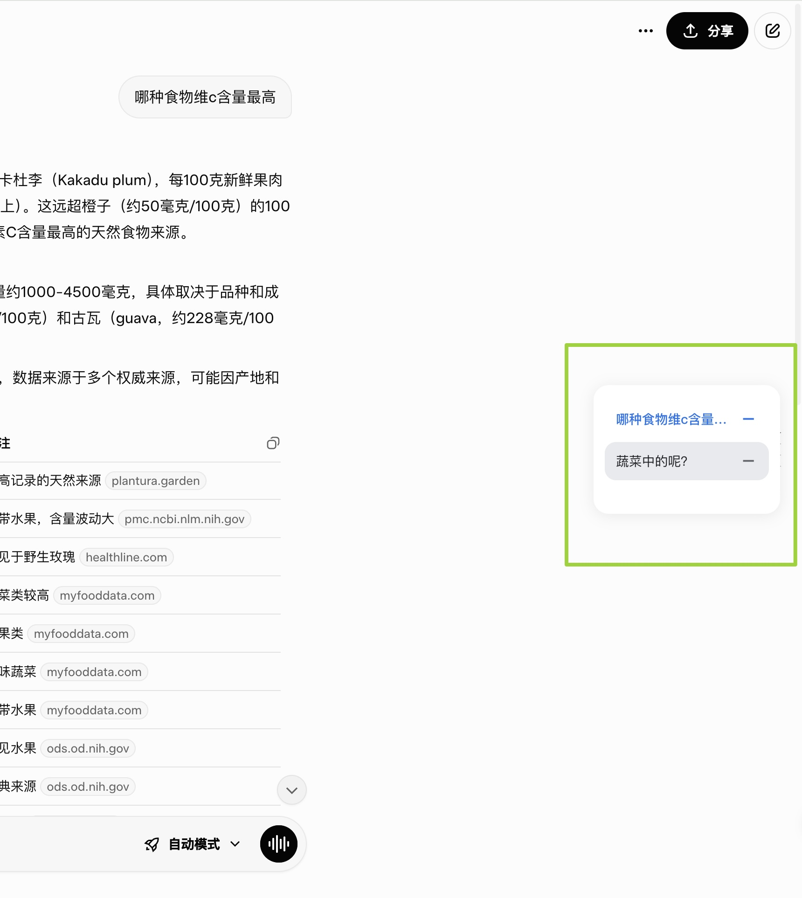
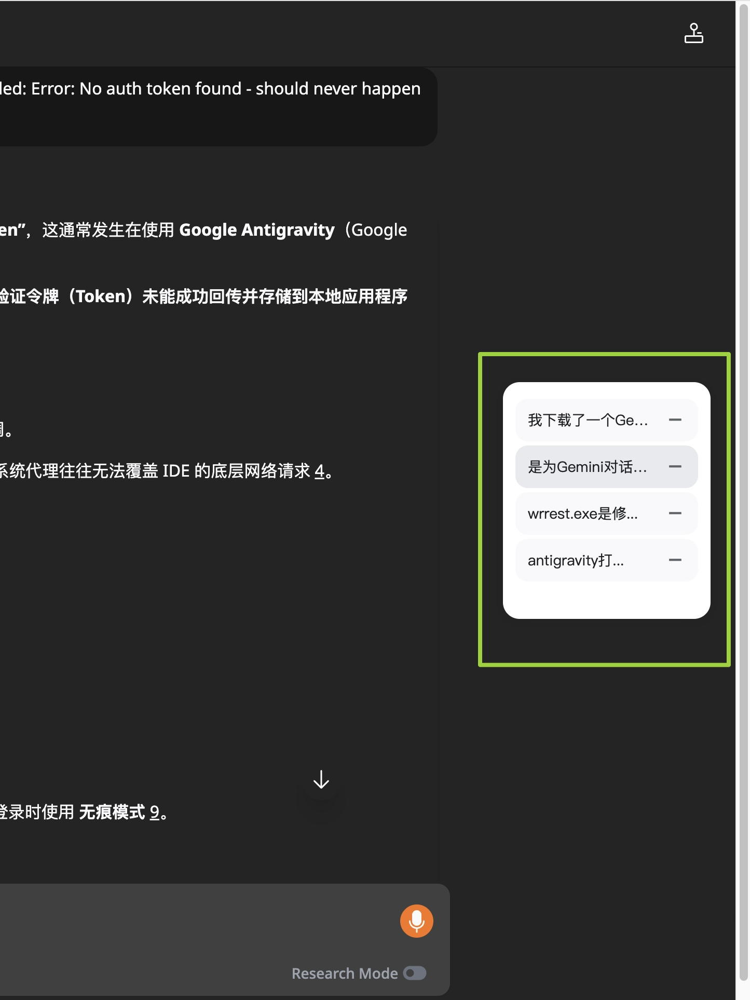

# AI Navigator by Ning Li

[中文] | [English]

---

## Preview / 预览

| ChatGPT | Gemini |
| :---: | :---: |
|  |  |

| Grok | Khoj |
| :---: | :---: |
|  |  |

---

## Project Overview / 项目简介

**Gemini & AI Navigator** 是一款专为 AI 对话设计的增强型浏览器扩展。它能够自动识别并提取 Gemini、Khoj (app.khoj.dev)、ChatGPT 和 Grok 页面中的对话内容，并在右侧生成一个智能悬浮目录。该项目旨在解决长对话场景下频繁翻找、上下文定位困难的痛点，显著提升阅读、调试与知识整理的效率。

**Gemini & AI Navigator** is an enhanced browser extension designed specifically for AI-driven conversations. It automatically identifies and extracts content from Gemini, Khoj (app.khoj.dev), ChatGPT, and Grok pages to generate an intelligent floating navigation sidebar. This project aims to address the pain points of navigating through long conversations and locating specific context, significantly improving the efficiency of reading, debugging, and knowledge organization.

---

## Key Features / 核心功能

*   **Map-Based Precise Deduplication / 基于 Map 对象的精准去重**
    使用 Map 算法以对话标题为键进行底层重构，确保在 Khoj 等动态加载页面上目录依然保持唯一，彻底拒绝重复项。  
    *Infrastructure refactored with a Map object (using titles as keys) to ensure directory uniqueness, effectively eliminating redundancies on dynamic sites like Khoj.*

*   **Intelligent 12-Item Constraint / 智能 12 条显示上限**
    自动保留最新 12 条对话，并配合优雅的底部 CSS 渐变遮罩（Gradient Mask），确保 UI 简洁专业且不遮挡页面内容。  
    *Automatically retains the 12 most recent items, paired with an elegant CSS gradient mask to maintain a clean, professional UI without obscuring page content.*

*   **SPA-Aware Route Monitoring / 针对单页应用的路由监听**
    内置单页应用（SPA）路由感知逻辑，无需手动刷新页面即可在对话切换时实时更新目录状态。  
    *Includes built-in Single Page Application (SPA) route sensing, enabling real-time directory updates during conversation switches without requiring a page refresh.*

*   **Robust Smooth-Scroll Jump / 鲁棒的平滑滚动跳转**
    针对异步加载场景优化的跳转逻辑，配合 100ms 智能延迟与居中对齐排布，确保每次点击都能精准定位到目标位置。  
    *Optimized jump logic for asynchronous loading scenarios, utilizing a 100ms intelligent delay and centered alignment to ensure precision with every click.*

---

## User Guide / 用户使用指南

### 1. 安装插件 (Installation)
1.  **下载源码 / Download Source**：将本项目文件夹（包含 `manifest.json`）保存到本地。  
    *Save this project folder (containing `manifest.json`) to your local machine.*
2.  **进入管理面试 / Extensions Page**：在 Chrome 地址栏访问 `chrome://extensions/`。  
    *Navigate to `chrome://extensions/` in your Chrome browser.*
3.  **开启开发者模式 / Developer Mode**：确保右上角的“开发者模式”开关已打开。  
    *Ensure the "Developer mode" switch in the top right is turned on.*
4.  **加载程序 / Load Unpacked**：点击“加载已解压的扩展程序”，选择本项目文件夹。  
    *Click "Load unpacked" and select this project folder.*

### 2. 配置 API Key (Configuration)
为了安全起见，官方发布版不内置 API Key，您需要使用自己的 Key：  
*For security, the official release does not include an API Key. You must use your own:*
1.  **获取 Key / Get Key**：前往 [Google AI Studio](https://aistudio.google.com/app/apikey) 免费申请。  
    *Request a free API Key from [Google AI Studio](https://aistudio.google.com/app/apikey).*
2.  **进入设置 / Settings**：在 Chrome 扩展程序列表中找到 **AI Navigator**，点击“详细信息” -> “扩展程序选项”。  
    *Find **AI Navigator** in the extensions list, click "Details" -> "Extension options".*
3.  **保存 Key / Save Key**：在设置页面粘贴您的 API Key 并点击 **Save Changes**。  
    *Paste your key into the settings page and click **Save Changes**. Your key is stored securely in your browser.*

### 3. 使用方法 (How to Use)
1.  **打开 AI 页面 / Open AI Site**：访问 [Gemini](https://gemini.google.com/) 或 [ChatGPT](https://chatgpt.com/) 等支持的站点。  
    *Visit supported sites like [Gemini](https://gemini.google.com/) or [ChatGPT](https://chatgpt.com/).*
2.  **悬浮目录 / Navigation Panel**：当检测到对话时，右侧会自动出现半透明面板。  
    *A semi-transparent panel will automatically appear on the right when conversations are detected.*
    - **鼠标悬停 / Mouse Hover**：面板会自动展开显示完整标题。  
      *The panel expands to show full titles upon hovering.*
    - **点击跳转 / Click to Jump**：点击目录项，页面会自动平滑滚动到目标位置。  
      *Click an item to smooth-scroll the page to that specific conversation.*
    - **删除条目 / Hide Item**：点击条目右侧的 `−` 号可临时隐藏该项。  
      *Click the `-` icon on the right to temporarily hide a navigation item.*

---

## Troubleshooting / 常见问题排查

*   **Console Debugging / 控制台调试**：
    由于采用了 `MutationObserver` 监控 DOM，你可以打开浏览器控制台查看 `[Gemini Nav]` 开头的日志，实时监控解析状态。  
    *As the extension utilizes `MutationObserver` for DOM monitoring, you can open the console to view logs prefixed with `[Gemini Nav]` for real-time status updates.*
*   **Why Jump is Reliable / 跳转为何如此可靠**：
    重构后的逻辑直接关联了 DOM 引用，而非依赖不稳定的数组索引，结合居中对齐模式（`block: 'center'`），确保了滚动位置的确定性。  
    *The refactored logic stores direct DOM references instead of relying on fragile indices. Combined with centered alignment (`block: 'center'`), it ensures deterministic scrolling.*

---

## Technical Principles / 技术原理

1.  **Map Deduplication / Map 去重**：
    遍历对话节点时，提取内容摘要作为 Key。若 Key 已存在，则直接跳过该节点并保留原始 DOM 引用在 Value 中，从而在数据源头完成去重。  
    *When traversing conversation nodes, descriptions are extracted as Map keys. If a key exists, the node is skipped while the original DOM reference is maintained in the value, ensuring deduplication at the source.*

2.  **MutationObserver / DOM 监听**：
    放弃了低效的 `setInterval` 轮询，采用 `MutationObserver` 深度监听对话容器的子树变更，实现毫秒级的响应式更新。  
    *Replaced inefficient `setInterval` polling with `MutationObserver` to perform deep monitoring of the conversation container's subtree, achieving millisecond-level reactive updates.*

---

**Designed with precision for the AI-first workflow.**  
**为 AI 优先的工作流精准打造。**
